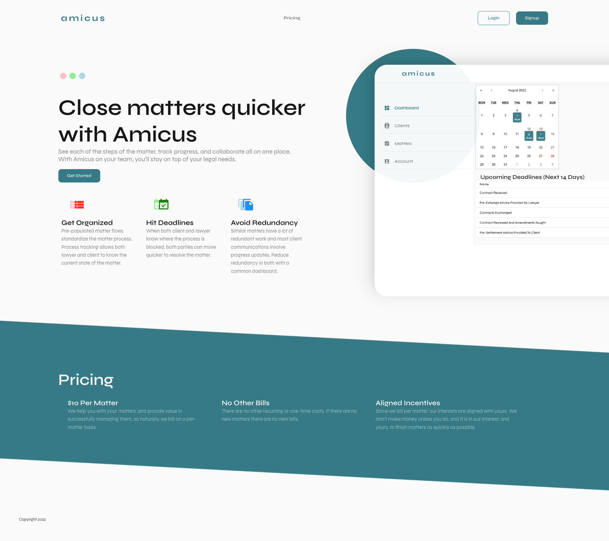

import Link from '@docusaurus/Link';
import useBaseUrl from '@docusaurus/useBaseUrl';

import InBlogCta from './components/InBlogCta';
import WaspIntro from './_wasp-intro.md';
import ImgWithCaption from './components/ImgWithCaption'

[Erlis Kllogjri](https://github.com/ErlisK) is an engineer based in San Francisco with broad experience ranging from mechanical engineering and C/C++ microcontroller programming to Python and web app development. In his free time, Erlis enjoys working on side projects, which is also how [Amicus](https://www.amicus.work/) started out.

[Amicus](https://www.amicus.work/) is a SaaS for legal teams - think about it as "Asana for lawyers", but with features and workflows tailored to the domain of law.

Read on to learn how long it took Erlis to develop the first version of his SaaS with Wasp, how he got his first paying customers, and what features he plans to add next!

<!--truncate-->

## Looking for a full-stack “all-in-one” solution, with React & Node.js

Erlis first learned about Wasp on HackerNews and it immediately caught his attention, particularly the configuration language part. One of the companies he worked at in the past had its own internal DSL in the hardware domain, and he understood how helpful it could be for moving fast and avoiding boilerplate.

Erlis also had previous experience in web development, especially on the front-end side in React and Javascript, so that made Wasp a logical choice.

> I was looking at other solutions, but none of them were full-stack and sounded like a lot of work just to stitch everything together and get started. I just wanted to get the job done and didn’t care about picking the stack specifics myself. Wasp was really helpful as it set me up with the best practices and I had everything running in just a few minutes!
>
> — Erlis Kllogjri - Amicus

## Building Amicus v1.0 and getting first customers!

The idea for Amicus came from his brother, who is employed at a law firm - talking about their process and challenges in executing them, Erlis thought it would be an interesting side project, especially given there is a real problem to solve.

Soon, the first version of Amicus was live! It was made in a true lean startup fashion, starting with the essential features and immediately being tested with users.

<ImgWithCaption
    alt="Amicus's dashboard"
    source="img/amicus-usecase/amicus-dashboard.png"
    caption="Amicus's dashboard, using Material-UI"
/>

Erlis used Material-UI as a UI library since it came with one of the example apps built in Wasp (Beta introduced Tailwind support!). Users could track their clients, active legal matters and there was even integrated billing with Stripe! Amicus also extensively used Wasp’s [Async Jobs](https://wasp-lang.dev/blog/2022/06/15/jobs-feature-announcement) feature to regularly update invoices, send reminder emails and clear out old data from the database.

After a few iterations with the legal team who were Amicus' test user (e.g. adding support for different types of users via roles), they were ready to get onboarded and become paying customers! More than 20 people from a single company are using Amicus daily for their work, making it an amazing source of continuous feedback for further development.

Erlis enjoyed the most how fast he could progress and ship features with Wasp on a weekly basis. Having both front-end, back-end, and database set and fully configured to work together from the beginning, he could focus on developing features rather than spend time figuring out the intricacies of the specific stack.

> If it weren't for Wasp, Amicus would probably have never been finished. I estimate it saved me 100+ hours from the start and I'm still amazed that I did all this work as a team-of-one. Being able to quickly change existing features and add the new ones is the biggest advantage of Wasp for me.
>
> — Erlis Kllogjri - Amicus

## Beyond MVP with Wasp

Although Erlis already has a product running in production, with first paying customers, he wants to see how far he can take it and has a lot of ideas (also requests) for the next features. *(Actually, Erlis had a big kanban board with post-its on a wall behind him as we were chatting, dedicated just to Amicus - that was impressive to see!)*. 

Some of the most imminent ones are:

- uploading and sharing files between lawyers and clients
- usage logging and analytics
- transactional emails for notifications

Since under the hood Wasp is generating code in today's mainstream, production-tested technologies such as React, Node.js and PostgreSQL (through Prisma), there aren't any technical limitations to scaling Amicus as it grows and attracts more users.

Also, given that the `wasp build` CLI command generates a ready Docker image for the back-end (and static files for the front-end), deployment options are unlimited. Since Heroku is shutting down its free plan, we added guides on how to deploy your project for free on [Fly.io](http://Fly.io) and Railway (freemium).

> I was using Wasp while still in Alpha and was impressed how well everything worked, especially given how much stuff I get. I had just a few minor issues and the team responded super quickly on Discord and helped me resolve it.
>
> — Erlis Kllogjri - Amicus
